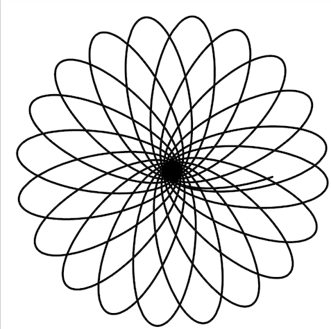
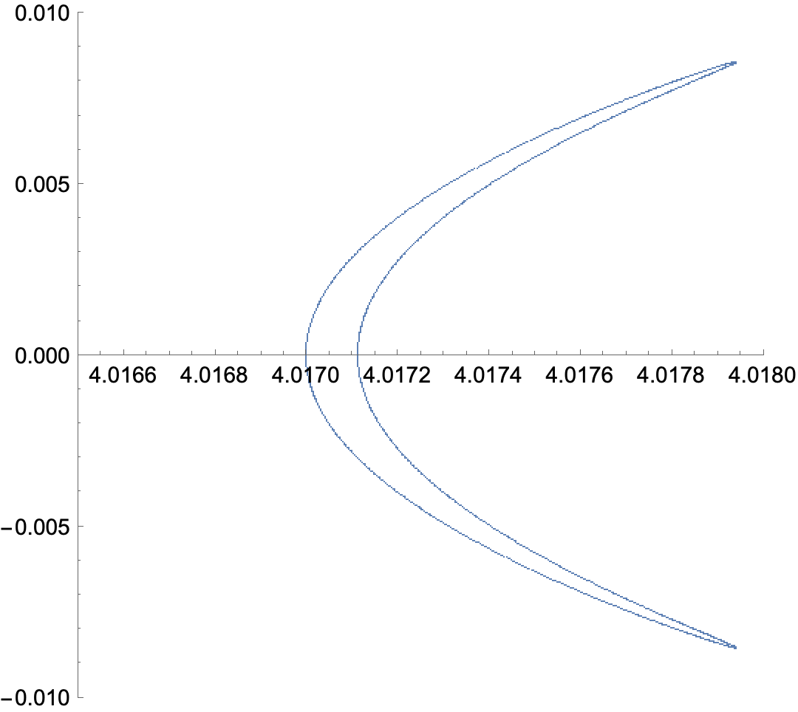

# Kerr Geodesics in slowly-rotating Kerr

Are the geodesics of spinning black holes integrable? In Ref [1], we tackled this question for black holes in dynamical Chern--Simons theory through an extensive and comprehensive numerical analysis. In particular, we calculated and studied the Poincaré surfaces of section and rotation numbers for a broad family of geodesics. In that work, we began by considering the geodesics problem of the Kerr spacetime, which we know is integrable. Our numerical analysis confirms this expectation when using the exact Kerr metric, but if one employs a slow-rotation expansion of the Kerr background, then clear chaotic features arise. This Mathematica code shows that, either by solving the Hamilton ([HamiltonianEvolution.nb](HamiltonianEvolution.nb)) or geodesic equations ([GeodesicEvolution.nb](GeodesicEvolution.nb)). 

The use of this code in scientific publications must be properly acknowledged. Please cite:

_______
[1] Alejandro Cárdenas-Avendaño, Andrés F Gutierrez, Leonardo A Pachón, and Nicolás Yunes: "The exact dynamical Chern Simons metric for a spinning black hole possesses a fourth constant of motion: A Dynamical-Systems-Based Conjecture." Class. Quantum Grav. 35 165010, 2018. [arXiv:804.04002](https://arxiv.org/abs/1804.04002) 
_______

We also request that modifications or extensions leading to a scientific publication be made public as free software. 

 <em>Feel free to use images and movies produced with this code (with attribution) for your next presentation! </em> 

	